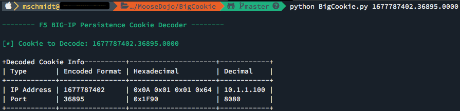

# BigCookie - F5 Big-IP Persistence Cookie Decoder

BigCookie takes the encoded F5 Big-IP persistence cookie, and decodes it to its decimal format, thus revealing the internal IP address and port of the load balanced destination.

The following is an example F5 Big-IP Persistence Cookie: **BIGipServerTestPool42=1677787402.36895.0000**

This cookie is broken up as follows:

1. The Pool: TestPool42
2. The encoded IP in decimal format: 1677787402
3. The encoded port in decimal format: 36895

## Addtional F5 Big-IP Cookie Information
For more information on the F5 Big-IP Persistence Cookie, please see the following resources:

* [K5714: Troubleshooting cookie persistence
](https://support.f5.com/csp/article/K5714)
* [K6917: Overview of BIG-IP persistence cookie encoding](http://support.f5.com/kb/en-us/solutions/public/6000/900/sol6917.html)
* [K7784: Configuring BIG-IP cookie encryption (9.x)
](https://support.f5.com/csp/article/K7784)
* [K14784: Configuring cookie encryption within the HTTP profile (10.x - 13.x)
](https://support.f5.com/csp/article/K14784)
* [K83419154: Overview of cookie persistence
](https://support.f5.com/csp/article/K83419154)

## Getting Started With BigCookie
The following sections will get you up and running with BigCookie. This is an extremely simple script with only two python packages needed for successful exeuction.

### Prerequisites Installation
BigCookie requires Click and Terminal Tables. Before running BigCookie, please install the preqequisites by running the following command at your terminal.

```
$ pip install -r requirements.txt
```

## BigCookie Usage
Once the requirements are installed, run the following command in your terminal to execute BigCookie:

```
$ python BigCookie.py persistence.cookie.value
```

*Example:* 

```
$ python BigCookie.py 1677787402.36895.0000
```



## Acknowledgments

* This project was inspired by
	*  [http://www.taddong.com/tools/BIG-IP\_cookie\_decoder.zip](http://www.taddong.com/tools/BIG-IP_cookie_decoder.zip)
	*  [https://support.f5.com/csp/article/K6917](https://support.f5.com/csp/article/K6917)
